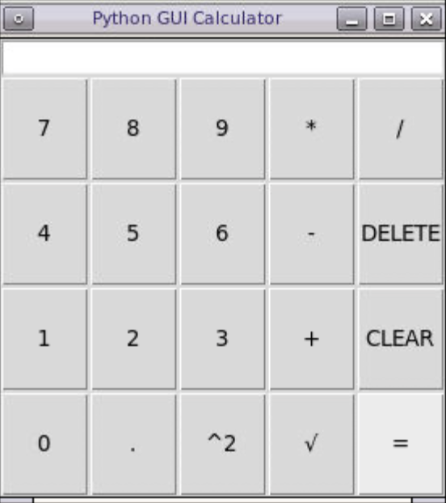
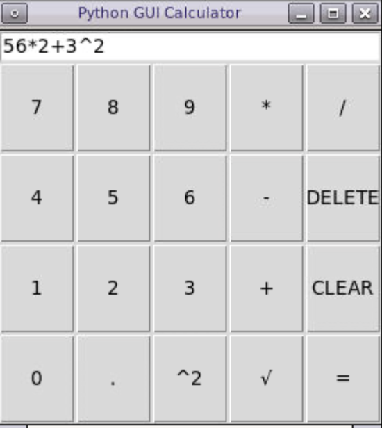

# Python GUI Calculator

The Python GUI Calculator is provides an easy and intutitive design to allow users to be able to perform basic calculations including addition, subtraction, multiplication, floating point division, integer division, and exponents (shortcuts to squareroot and square provided). Built using Python's Tkinter GUI library, users can press on buttons to enter data or manually enter data using their keyboard. To work with exponents, users can input base**exponent to have it evalulate as base^exponent.

  
  

The Entry, Equals, Clear, Delete button objects were created separately as they have unique functions. The other buttons were stored in a 2D list and created using a FOR loop. This method reduces the overall clutter that would be required by creating each button separately. Challenges arose while setting the command attribute for the button objects, as the Python interpreter was unable to read the various values of the loop but only read the last iteration and assigned that value to each button. Eventually a lambda function using the below syntax was used to prevent this issue as a local iteration number was stored to let each iteration have their unique argument.

Feel free to connect with me on any of the following platforms to talk about question, possible collaborations, opportunities, events, tech, or for fun!! Can't wait to meet you!

  

  

  

  

